<div align="center">

# P2P Lending Default Risk Prediction

### Machine learning-based credit risk analysis for predicting loan default in Peer-to-Peer lending using the Bondora loan dataset.

<br/>


<br/><br/>

[Overview](#-overview) •
[Objectives](#-project-objectives) •
[Dataset](#-dataset-overview) •
[EDA](#-exploratory-data-analysis) •
[Methodology](#-methodology) •
[Models](#-model-development) •
[Results](#-model-performance) •
[Tech Stack](#️-tech-stack) •
[My Role](#-my-role)

</div>

---

## 📌 Overview

**P2P Lending Default Risk Prediction** is a machine learning project developed during my **Data Scientist Internship at Technocolabs Softwares Inc.**

The project focuses on analyzing and predicting **loan default risk in Peer-to-Peer (P2P) lending** using historical loan data from **Bondora**, a European P2P lending platform.

P2P lending introduces financial risk because loans are generally unsecured and lending decisions are made under information asymmetry between borrowers and lenders.

This project applies an end-to-end data science workflow to transform raw borrower and loan transaction data into a structured dataset and develop predictive models capable of identifying potential loan default risk.

The analysis includes:

- Data preprocessing
- Missing value analysis
- Exploratory Data Analysis
- Outlier handling
- Feature encoding
- Feature selection
- Feature scaling
- Dimensionality reduction experimentation
- Machine learning modeling
- Model evaluation

---

## 🎯 Project Objectives

The main objectives of this project were to:

- Understand borrower and loan characteristics related to credit risk.
- Clean and preprocess a large P2P lending dataset.
- Construct a binary target variable representing loan default status.
- Explore patterns associated with defaulted and non-defaulted loans.
- Handle missing values and outliers.
- Transform categorical variables into machine-readable features.
- Identify relevant predictors using feature selection techniques.
- Standardize features for machine learning.
- Experiment with dimensionality reduction using PCA.
- Develop classification models for loan default prediction.
- Compare model performance using classification metrics.
- Identify the better-performing model for credit risk prediction.

---

## 📂 Dataset Overview

The project uses the **Bondora Peer-to-Peer Lending Loan Dataset**, containing borrower demographic information, financial characteristics, and loan transaction records.

| Information | Details |
|---|---|
| **Data Source** | Bondora P2P Lending |
| **Initial Records** | 179,235 |
| **Initial Features** | 112 |
| **Data Period** | March 2009 – January 2020 |
| **Problem Type** | Binary Classification |
| **Target Variable** | `LoanStatus` |
| **Target Classes** | Default / No Default |

The dataset contains information related to:

- Borrower demographics
- Loan amount
- Interest rate
- Loan duration
- Monthly payments
- Income
- Existing liabilities
- Debt-to-income ratio
- Employment characteristics
- Education
- Credit rating
- Previous loans
- Previous repayments
- Loan purpose
- Home ownership
- Credit score
- Loan performance

---

## 🎯 Target Variable

The original dataset did not provide a direct binary default target suitable for modeling.

The target variable **`LoanStatus`** was therefore created using loan status information and the availability of `DefaultDate`.

Current loans were excluded because their final repayment outcomes were not yet known.

The resulting target classes were:

```text
Default
No Default
```

After removing current loans, the modeling dataset contained:

| Loan Status | Records |
|---|---:|
| **Default** | 71,253 |
| **No Default** | 50,208 |
| **Total** | 121,461 |

---

## 🔎 Exploratory Data Analysis

Exploratory Data Analysis was conducted to better understand borrower characteristics and identify patterns associated with loan default.

### Categorical Analysis

The analysis explored default patterns across:

- Country
- Gender
- New Credit Customer status
- Language
- Education level
- Employment status
- Marital status
- Loan purpose
- Employment duration
- Occupation area
- Home ownership
- Bondora Rating
- Credit Score

### Numerical Analysis

Numerical features analyzed included:

- Age
- Applied Amount
- Loan Amount
- Interest
- Loan Duration
- Monthly Payment
- Income
- Debt-to-Income Ratio
- Free Cash
- Previous Repayments
- Previous Loan Amounts
- Principal Balance
- Interest Balance

The EDA helped identify relationships between borrower characteristics, loan characteristics, and default behavior before model development.

---

## 🧹 Data Preprocessing

The raw dataset required extensive preprocessing before it could be used for machine learning.

### Missing Value Analysis

Approximately **26% of the cells in the original dataset contained missing values**.

Features with more than **40% missing values** were reviewed and removed where appropriate.

The dataset was reduced from:

```text
112 initial features
        ↓
74 features after missing-value filtering
        ↓
43 relevant features after additional preprocessing
```

Other unnecessary variables were removed, including identifiers, redundant income variables, and date-related variables that were not required for the predictive modeling task.

---

## ⚙️ Methodology

The project followed an end-to-end machine learning workflow:

```mermaid
flowchart LR
    A[Raw Bondora Data]
    B[Data Understanding]
    C[Data Cleaning]
    D[Target Creation]
    E[Exploratory Data Analysis]
    F[Feature Engineering]
    G[Feature Selection]
    H[Feature Scaling]
    I[Model Development]
    J[Model Evaluation]

    A --> B
    B --> C
    C --> D
    D --> E
    E --> F
    F --> G
    G --> H
    H --> I
    I --> J
```



---

## 🛠️ Feature Engineering

Several feature engineering techniques were applied to prepare the data for machine learning.

### 1. Missing Value Handling

Missing values were analyzed and handled according to feature characteristics.

This included:

- Removing highly incomplete variables.
- Replacing missing numerical values.
- Handling missing categorical values.
- Standardizing inconsistent category representations.

---

### 2. Outlier Handling

Numerical outliers were identified using the **Interquartile Range (IQR)** method.

Values outside the lower and upper IQR boundaries were capped to reduce the influence of extreme observations.

The process was applied across numerical features such as:

- Age
- Loan Amount
- Applied Amount
- Monthly Payment
- Income
- Free Cash
- Previous Repayments

---

### 3. Categorical Encoding

Categorical features were transformed into numerical representations using **Label Encoding**.

Encoded variables included characteristics such as:

- Gender
- Verification Type
- Language
- Education
- Employment Status
- Loan Purpose
- Occupation Area
- Home Ownership
- Rating
- Credit Score

---

### 4. Feature Selection

Feature selection was performed to reduce unnecessary information and retain variables that provide useful predictive information.

Two approaches were explored:

#### Correlation-Based Filtering

Highly correlated variables were identified to reduce redundant information.

#### Mutual Information

`SelectKBest` with `mutual_info_classif` was used to select **15 informative features** for model development.

Selected features included variables related to:

- Loan characteristics
- Interest
- Loan duration
- Monthly payment
- Recovery stage
- Credit rating
- Restructuring
- Principal payments
- Interest payments
- Outstanding balances

---

### 5. Feature Scaling

Selected features were standardized using:

**StandardScaler**

This transformed numerical features to a standardized scale before model development.

---

### 6. PCA Experiment

**Principal Component Analysis (PCA)** was explored as a dimensionality reduction technique.

Using two principal components retained approximately **40% of the explained variance**.

Because this representation did not provide sufficient information for the modeling objective, PCA was not used in the final model pipeline.

---

## 🤖 Model Development

The data was divided into:

```text
80% Training Data
20% Testing Data
```

with:

```python
random_state = 42
```

Two supervised machine learning classification models were developed.

### 1. Logistic Regression

Logistic Regression was used as a baseline classification model for predicting loan default status.

### 2. Random Forest Classifier

Random Forest was implemented as an ensemble-based classification model capable of modeling more complex nonlinear relationships between borrower characteristics and loan outcomes.

---

## 📈 Model Performance

The models were evaluated using:

- Accuracy
- ROC-AUC
- Confusion Matrix

### Model Comparison

| Model | Accuracy | Reported ROC-AUC |
|---|---:|---:|
| **Logistic Regression** | **90.59%** | **0.9108** |
| **Random Forest Classifier** | **95.81%** | **0.9613** |

### Logistic Regression

```text
Accuracy : 90.59%
ROC-AUC  : 0.9108
```

Confusion Matrix:

```text
[[12679, 1667],
 [  619, 9328]]
```

### Random Forest

```text
Accuracy : 95.81%
ROC-AUC  : 0.9613
```

Confusion Matrix:

```text
[[13540,  806],
 [  211, 9736]]
```

Based on the model evaluation implemented in the notebook, **Random Forest achieved higher predictive performance than Logistic Regression**.

---

## 🏆 Model Comparison Summary

```text
Logistic Regression
Accuracy  ██████████████████░░  90.59%

Random Forest
Accuracy  ███████████████████░  95.81%
```

The experiment demonstrates how ensemble-based machine learning can capture more complex patterns in borrower and loan characteristics compared with the baseline linear model used in this project.

---

## 🛠️ Tech Stack

<div align="center">


</div>

| Technology | Usage |
|---|---|
| **Python** | End-to-end data analysis and machine learning |
| **Pandas** | Data manipulation, cleaning, and preprocessing |
| **NumPy** | Numerical operations |
| **Matplotlib** | Data visualization |
| **Seaborn** | Statistical visualization and EDA |
| **Plotly** | Interactive visualization |
| **Scikit-learn** | Preprocessing, feature selection, scaling, modeling, and evaluation |

---

## 🧠 Machine Learning Techniques

This project demonstrates practical implementation of:

- Binary Classification
- Credit Risk Modeling
- Data Cleaning
- Missing Value Handling
- Exploratory Data Analysis
- Outlier Detection
- IQR-Based Outlier Treatment
- Categorical Encoding
- Correlation Analysis
- Mutual Information Feature Selection
- Feature Scaling
- Principal Component Analysis
- Train-Test Split
- Logistic Regression
- Random Forest
- Classification Evaluation

---

## 👨‍💻 My Role

As a **Data Scientist Intern at Technocolabs Softwares Inc.**, I worked on an end-to-end machine learning project focused on predicting default risk in Peer-to-Peer lending.

My contributions included:

- Exploring a large-scale P2P lending dataset.
- Understanding borrower and loan characteristics.
- Performing missing value analysis and data cleaning.
- Creating the loan default target variable.
- Conducting exploratory data analysis.
- Analyzing borrower and credit-risk characteristics.
- Handling numerical outliers using IQR.
- Encoding categorical variables.
- Performing correlation-based feature analysis.
- Applying mutual-information-based feature selection.
- Standardizing machine learning features.
- Experimenting with PCA for dimensionality reduction.
- Developing Logistic Regression and Random Forest models.
- Evaluating model performance using classification metrics.
- Comparing predictive performance across models.

---

## 💼 Internship Information

| Information | Details |
|---|---|
| **Role** | Data Scientist Intern |
| **Organization** | Technocolabs Softwares Inc. |
| **Project** | P2P Lending Default Risk Prediction |
| **Domain** | FinTech / Credit Risk |
| **Dataset** | Bondora P2P Lending |
| **Tools** | Python, Pandas, NumPy, Scikit-learn, Matplotlib, Seaborn, Plotly |
| **Models** | Logistic Regression, Random Forest |
| **Focus Areas** | Data Science, Machine Learning, Credit Risk Modeling, Predictive Analytics |

---

## 📂 Repository Structure

```text
technocolabs-data-science/
│
├── README.md
│
├── notebooks/
│   └── loan-risk-analysis.ipynb
│
└── assets/
    ├── eda/
    └── model-results/
```

---

## 📚 Data Source

The project uses the publicly available **Bondora P2P Lending Dataset**.

**Bondora Public Reports:**  
https://www.bondora.com/en/public-reports

---

## ⚠️ Disclaimer

This project was developed for educational and analytical purposes as part of my Data Scientist Internship.

The model results represent experiments performed on the dataset used in this project and should not be interpreted as a production-ready credit scoring or lending decision system.

---

<div align="center">

## P2P Lending Default Risk Prediction

**Data Scientist Internship Project — Technocolabs Softwares Inc.**

`Python` • `Scikit-learn` • `Machine Learning` • `Credit Risk` • `Predictive Analytics`

<br/>

> **“Transforming borrower and loan data into predictive insights for better credit risk assessment.”**

</div>
